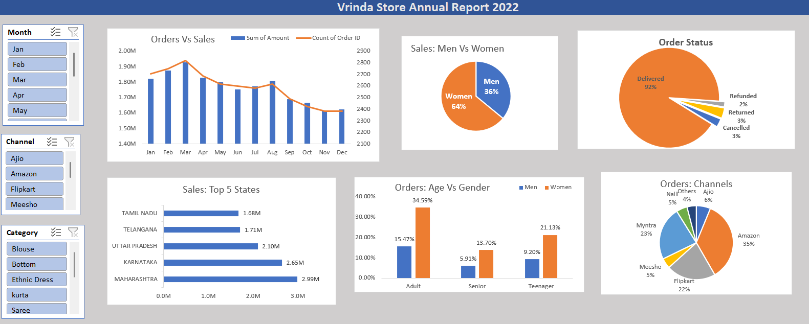

# Vrinda Store Data Analysis

## Project Overview

This project analyzes Vrinda Store sales data to identify customer purchasing behavior, sales trends, order patterns, and business performance. The analysis was performed using Microsoft Excel and interactive dashboards were created to generate actionable business insights.

## Tools Used

* Microsoft Excel
* Pivot Tables
* Pivot Charts
* Slicers
* Conditional Formatting

## Business Objectives

* Analyze overall sales performance.
* Identify top-performing states and sales channels.
* Understand customer demographics and buying behavior.
* Determine best-selling product categories.
* Generate insights for data-driven decision-making.

## Key Insights

* Women customers contributed the majority of total sales.
* Amazon was the leading sales channel.
* Maharashtra, Karnataka, and Uttar Pradesh were among the top-performing states.
* Adult age groups generated the highest number of orders.
* Clothing categories contributed significantly to overall revenue.

## Dashboard Features

* Sales by Month
* Sales by State
* Sales by Gender
* Sales by Age Group
* Sales by Channel
* Category-wise Performance
* Interactive Slicers and Filters

## Dashboard Preview

## Author

Tanishka Jain
